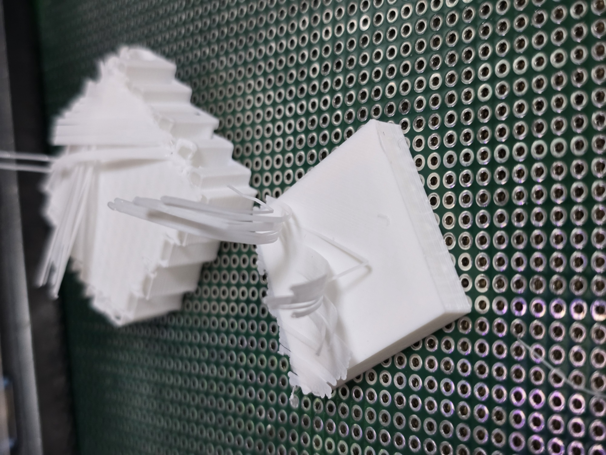
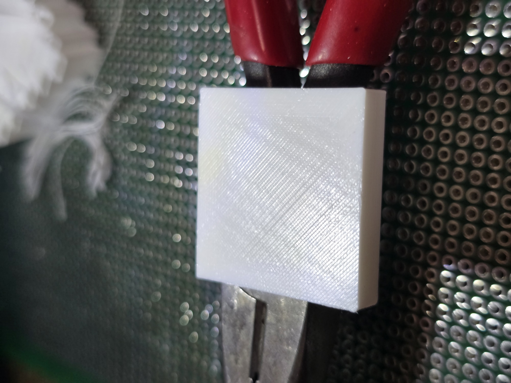
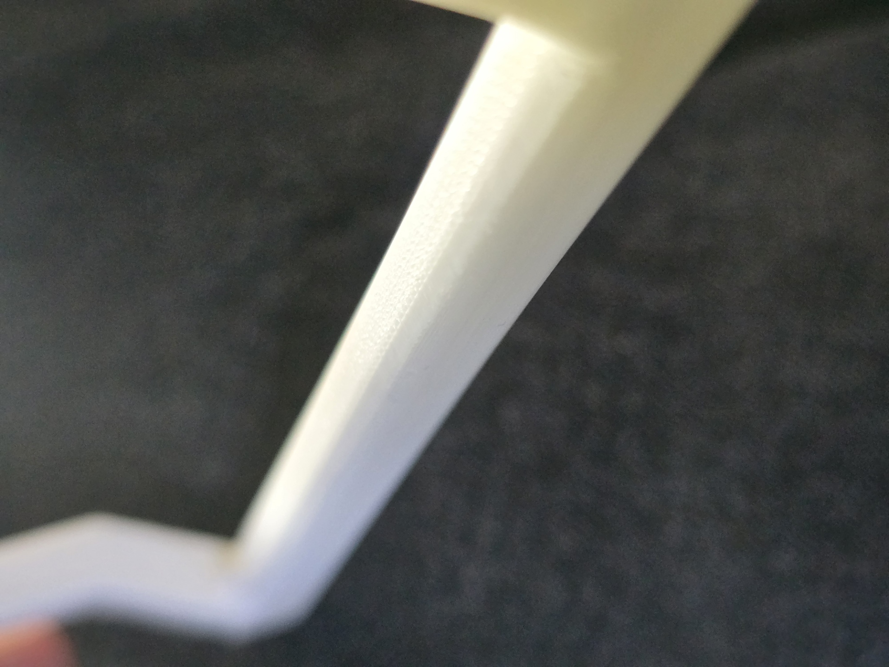
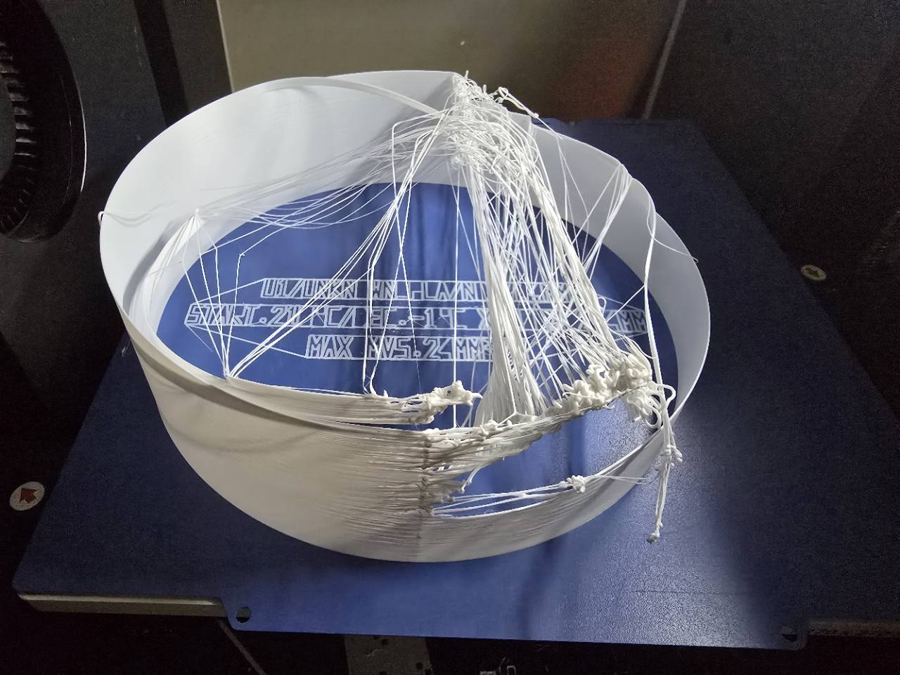
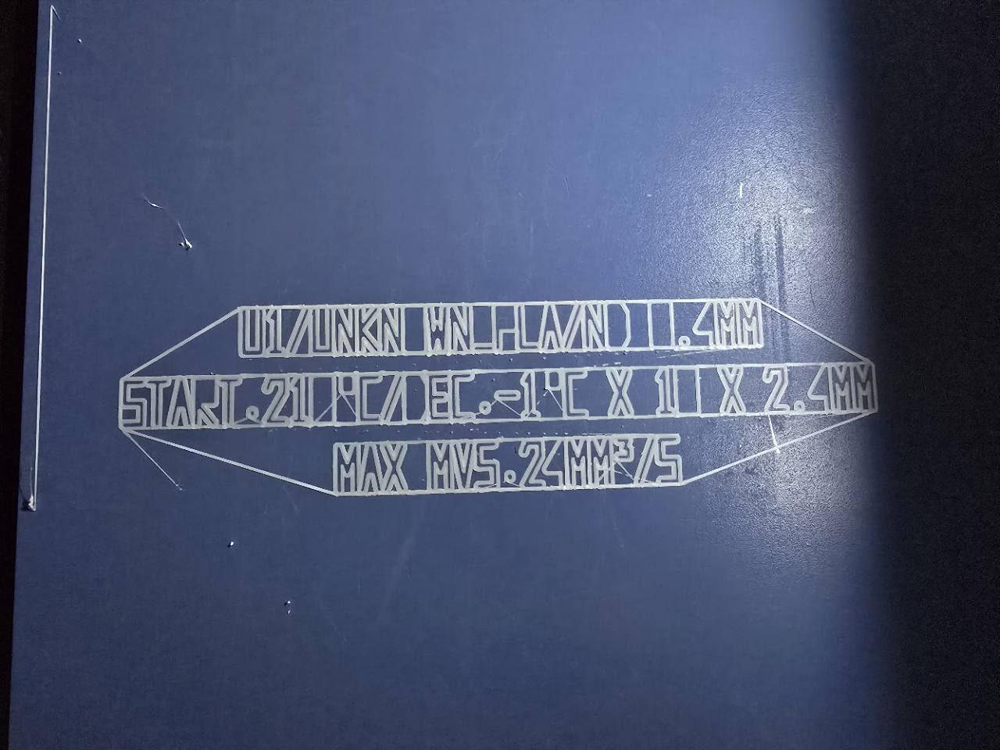

# LESIC

**Lowtemp Extrusion Support Interface Calibration**

LESIC는 FDM 3D 프린팅에서 저온 서포트 인터페이스 조건을 찾기 위한 standalone G-code 생성기입니다.  
온도 밴드를 단계적으로 바꾸고, 원형 경로를 따라 MVS를 연속적으로 변화시키는 테스트 출력을 생성하여, 실제로 사용할 수 있는 저온 인터페이스 조건을 반복 가능하게 찾을 수 있도록 설계되었습니다.

**Web app:** [https://gen7920335.github.io/LESIC/](https://gen7920335.github.io/LESIC/)  
**Beta web app:** [https://gen7920335.github.io/LESIC-beta/](https://gen7920335.github.io/LESIC-beta/)

자세한 사용설명은 [USAGE_KR.md](USAGE_KR.md)를 참고하세요.

---

## What Is Lowtemp Extrusion Support Interface?

Lowtemp Extrusion Support Interface는 모델 본체보다 더 낮은 노즐 온도로 서포트 접촉면을 출력하는 방식을 의미합니다.

목표는 다음과 같습니다.

- 서포트와 모델의 결합력을 낮춘다
- 서포트를 더 쉽게 제거한다
- 같은 재질을 사용하더라도 분리성을 더 좋게 만든다
- 지지된 아랫면 품질을 가능한 한 유지한다

같은 재질로 출력하더라도, 인터페이스 온도와 압출 조건을 조절하면 접착력을 꽤 세밀하게 바꿀 수 있습니다.

---

## Why This Calibration Matters

이 도구의 목적은 "예쁘게 성공하는 출력물"을 만드는 것이 아닙니다.  
중요한 것은 출력 실패 직전까지 유지되는 가장 낮은 압출온도와, 그 온도에서 버틸 수 있었던 최대 MVS를 읽어내는 것입니다.

즉 LESIC는 다음 질문에 답하기 위한 도구입니다.

- 실제로 쓸 수 있는 최저 압출온도는 얼마인가?
- 그 최저 온도에서 어느 정도 MVS까지 안정적으로 유지되는가?
- 어디서부터 스트링잉, 붕괴, 압출 실패가 시작되는가?

---

## Lowtemp Interface Result Examples

아래 사진들은 실제 저온 서포트 인터페이스 결과 예시입니다.

---

## What LESIC Does

LESIC는 아래 내용을 포함한 standalone G-code를 생성합니다.

- `G28` 홈 복귀
- 베드 및 노즐 가열
- 바닥 식별 라벨 출력
- 원형 테스트 바디 출력
- 높이에 따라 온도 밴드 변경
- 원주를 따라 MVS 연속 변화
- 원통 내부 바닥에 MVS 숫자와 눈금 표시

---

## Current Web UI Defaults

현재 웹 UI 기본값은 다음과 같습니다.

- `mvs_min`: `8`
- `mvs_max`: `24`
- default nozzle: `0.4 mm`
- default start temperature: `210°C`
- default end temperature: `165°C`
- default layers per band: `10`
- arc segments: `360`

---

## Supported Nozzle Sizes

현재 웹 UI는 아래 노즐 구경을 지원합니다.

- `0.8 mm`
- `0.6 mm`
- `0.4 mm`
- `0.25 mm`
- `0.2 mm`
- `0.15 mm`

원형 테스트 선폭은 노즐 구경에 맞춰 자동 선택됩니다.

- `0.8 mm` -> `0.96 mm`
- `0.6 mm` -> `0.72 mm`
- `0.4 mm` -> `0.48 mm`
- `0.25 mm` -> `0.30 mm`
- `0.2 mm` -> `0.24 mm`
- `0.15 mm` -> `0.18 mm`

적층높이는 노즐 구경의 60%로 자동 설정됩니다.

---

## Recommended Print Conditions

OrcaSlicer 기준 권장 설정:

- `Support expansion`: `1 mm` 이상
- `Fan speed / Cooling`: `100%`
- `Top interface spacing`: `0`
- `Top interface pattern`: `Rectilinear Interlaced`
- `Top interface pattern angle`: `22.5`
- `Top interface layers`: `4`

서포트 재질 할당은 다음처럼 사용하는 것을 권장합니다.

- 출력물, 서포트 재질: 필라멘트의 원래 프로파일
- 서포트 인터페이스 재질: LESIC 캘리브레이션으로 찾은 저온 프로파일

---

## Quick Start

1. 프린터 프리셋 선택
2. 노즐 구경 선택
3. 온도 범위 설정
4. MVS 범위 설정
5. Preview 확인
6. Generate G-code 실행

---

## How To Read The Print

- 높이 방향은 온도 밴드입니다.
- 원주 방향은 MVS입니다.
- 원통 내부 바닥에는 숫자 라벨과 1 MVS 단위 눈금이 들어갑니다.
- 중요한 것은 실패한 부분이 아니라 **실패 직전까지 유지된 마지막 안정 구간**입니다.

즉 최종적으로 읽고 싶은 값은 다음 두 가지입니다.

- 가장 낮은 안정 압출온도
- 그 온도에서 유지 가능한 최대 MVS

상세한 해석 방법과 실제 계산 예시는 [USAGE_KR.md](USAGE_KR.md)를 참고하세요.

---

## Calibration Print Examples

아래 사진은 실제 캘리브레이션 출력물 결과 예시입니다.

